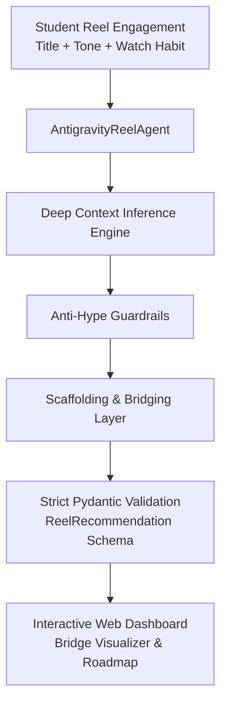

# 🚀 Antigravity AI Reel-to-Tech Recommendation Agent

An expert AI Content Recommendation Agent designed to optimize short-form video consumption for students. It analyzes casual Reel engagement (memes, lifestyle, gaming, tech news, benchmarks) and converts passive entertainment habits into high-signal, educational tech learning pathways.

---

## 🌟 Core Operational Principles

1. **Deep Context Inference (No Shallow Keyword Matching)**:
   - Does NOT map basic keywords directly (e.g. watching a Java syntax meme never returns generic Java 101).
   - Infers the root technical discipline (e.g., compiler lexical analysis, abstract syntax trees, JVM bytecode, computer architecture, TLS 1.3 handshakes).

2. **Anti-Hype & Anti-Clickbait Filter**:
   - Strictly prohibits superficial listicles ("Top 10 AI Tools to Get Rich", "Learn Coding in 5 Mins").
   - Focuses strictly on core Computer Science foundations, systems design, and production engineering practices.

3. **Scaffolding & Bridging**:
   - Bridges the student's natural curiosity to bite-sized, high-leverage technical concepts with appropriate difficulty and confidence ratings.

---

## 📋 Strict Output Schema

```text
CURRENT REEL: [Reference to input Reel]
INTEREST DETECTED: [Specific core technical or engineering topic inferred]
WHY: [Concise evidence from the Reel's context, tone, and themes]
RECOMMENDED TECH REEL: [Specific, high-signal video title/topic]
CATEGORY: [AI / DSA / Java / HLD / Cybersecurity / Cloud / Hardware / Career / Other]
WHY THIS RECOMMENDATION: [Clear explanation of how this bridges casual interest to real technical depth without hype]
DIFFICULTY: [Beginner / Intermediate / Advanced]
CONFIDENCE: [High / Medium / Low]
```

---

## 🛠️ Quickstart & Setup

### 1. Install Dependencies
```bash
python -m pip install -r requirements.txt
```

### 2. Run Automated Test Suite
```bash
python test_agent.py
```

### 3. Launch the Interactive Web Dashboard
```bash
python server.py
```
Open **http://localhost:8000** in your browser.

### 4. Run via CLI
```bash
# Run default batch evaluation in strict schema format
python cli.py

# Run with JSON output
python cli.py --output json

# Run using a custom JSON batch file
python cli.py --file path/to/my_reels.json

# Use with Gemini or OpenAI API Key
python cli.py --provider gemini --api-key YOUR_GEMINI_KEY
```

---

## 🏛️ System Architecture



---

## 📡 API Endpoints

- `POST /api/recommend` - Evaluates a batch of reels using configured LLM or high-signal heuristic engine.
- `GET /api/presets` - Curated sample reel library spanning 8 engineering categories.
- `GET /api/categories` - Technical taxonomy and domain metadata.
- `POST /api/deep-dive` - Generates 15-minute hands-on coding challenges and prerequisite roadmaps.
- `POST /api/veo/generate` - Synthesizes hyper-detailed 4K 60FPS 9:16 vertical Gemini Veo 2 video explanation reels with camera directions, keyframes, subtitles, and narration scripts.
- `GET /api/veo/gallery` - Returns curated showcase gallery of Gemini Veo 4K Video Explanations across computer science domains.
- `POST /api/veo/prompt-export` - Generates and formats production-ready prompts ready for Google DeepMind Veo / Google AI Studio.

---

## ✨ Google Gemini Veo 2 AI Explanation Reels

The agent features an integrated **Gemini Veo 2 AI Video Reel Engine** that converts abstract computer science concepts into 9:16 vertical 3D cinematic explanation reels:
- **4K UHD 60FPS Raytraced Simulation**: Real-time 60 FPS procedural 3D visual canvas rendering neural attention beams, distributed consensus rings, CPU memory cache lines, compiler AST assembly, and TLS cryptographic shields.
- **Production-Grade Veo 2 Camera Directions**: FPV dolly pushes, macro zooms, and orbital crane scans with precise lighting shaders and color profiles.
- **Multi-Stage Keyframe Storyboards**: Synchronized scene timestamps (0.0s, 4.5s, 9.5s), technical annotations, and voiceover scripts.
- **Audio Narration & Subtitle Sync**: Web Speech API speech synthesis narration with animated multi-bar frequency audio spectrum.
- **Omnipresent 1-Click Launch**: Watch Gemini Veo reels directly from the Live Reel Feed, Real-Time AI HUD, AI Studio, or dedicated **Gemini Veo 3D Theater**.
